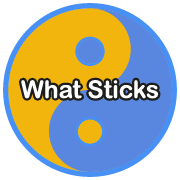

# What Sticks 11 Data Tools



## Description
These packages provide calculations and data reshaping data for the What Sticks suite of applications. What Sticks 11 Data Tools consists of two custom Python packages, ws_analysis and ws_utilities. Mainly here we are calculating correlations and creating dataframe's either for .csv/.pkl files or for direct use in another process.


## Installation Instructions
To install the What Sticks 11 Data Tools, clone the repository and install the required dependencies:
```
git clone [repository-url]
cd WhatSticks11DataTools
pip install -e .
```


## Usage
After installation, import the modules into your Python projects as needed:

```python
from ws_analysis import create_user_qty_cat_df, create_user_workouts_df, \
    create_df_daily_sleep, \
    create_df_n_minus1_daily_sleep, \
    create_df_daily_steps, \
    create_df_n_minus1_daily_steps, \
    create_df_daily_heart_rate, \
    create_df_n_minus1_daily_heart_rate, \
    create_df_daily_workout_duration, \
    create_df_daily_workout_duration_dummies, \
    corr_sleep_steps, \
    corr_sleep_heart_rate, corr_sleep_workouts, \
    corr_workouts_sleep, \
    corr_workouts_steps, corr_workouts_heart_rate, corr_sleep_workout_dummies
from ws_utilities import interpolate_missing_dates_exclude_references, \
    add_weather_history
```


## Features
All features are specific to What Sticks Platform Applicaitons and leverage the WS11Core library to map to database and directories for resources
- create dataframes
- calculate correlations
- user dataframes for the website
- create pickle dataframes to lessen the need to make database calls


## Note on ws_utilities
The subdirectories within ws_utilities will be labeled by the application within the platform that first required the process. It will start with a main.py. The intention is that these processes will be reused and to not duplicate difficult or complicated tasks. As we develop better ways or run into problems we want to fix them in one place.


## Contributing

We welcome contributions to the What Sticks project.

For any queries or suggestions, please contact us at nrodrig1@gmail.com.